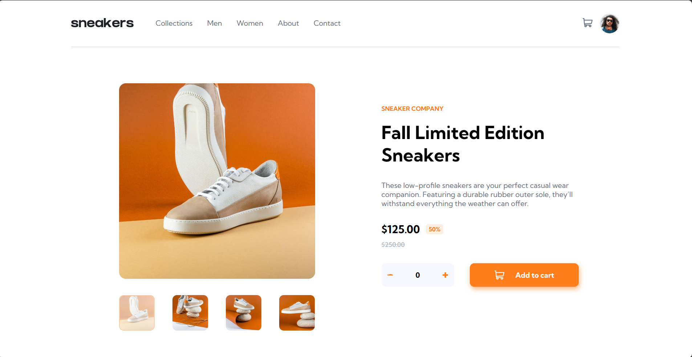
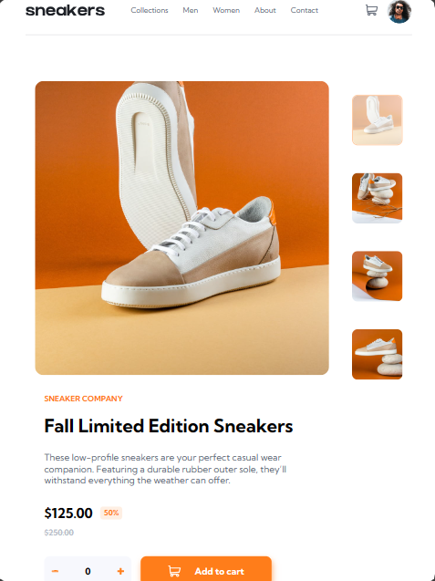
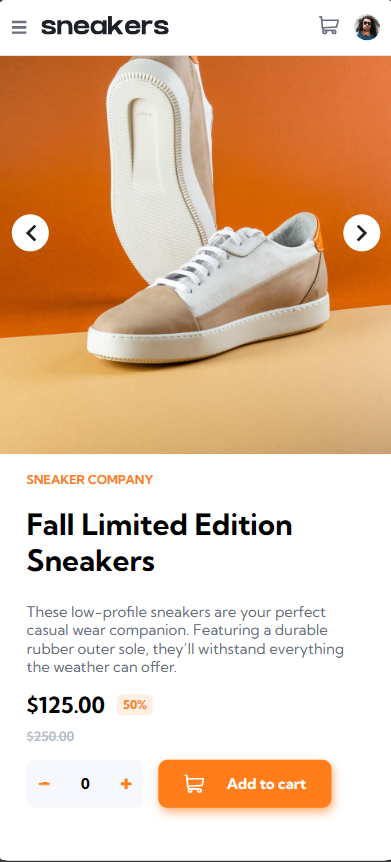
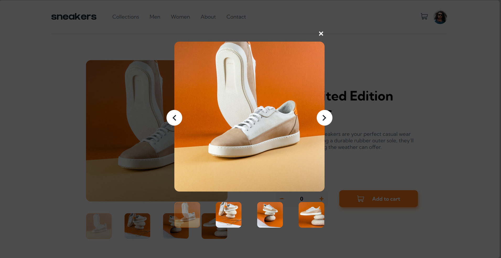
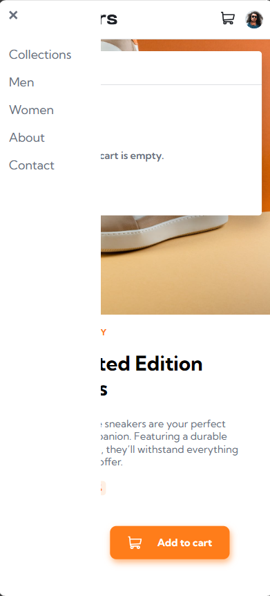

# Frontend Mentor - E-commerce product page solution

This is a solution to the [E-commerce product page challenge on Frontend Mentor](https://www.frontendmentor.io/challenges/ecommerce-product-page-UPsZ9MJp6). Frontend Mentor challenges help you improve your coding skills by building realistic projects.

## Table of contents

- [Overview](#overview)
  - [The challenge](#the-challenge)
  - [Screenshot](#screenshot)
  - [Links](#links)
- [My process](#my-process)
  - [Built with](#built-with)
  - [What I learned](#what-i-learned)
  - [Useful resources](#useful-resources)
- [Author](#author)
- [Acknowledgments](#acknowledgments)

## Overview

### The challenge

Users should be able to:

- View the optimal layout for the site depending on their device's screen size
- See hover states for all interactive elements on the page
- Open a lightbox gallery by clicking on the large product image
- Switch the large product image by clicking on the small thumbnail images
- Add items to the cart
- View the cart and remove items from it

### Screenshot







### Links

- Solution URL: [Add solution URL here](https://your-solution-url.com)
- Live Site URL: (https://mbungai-francesco.github.io/Product_page/)

## My process

### Built with

- Semantic HTML5 markup
- CSS custom properties
- Flexbox
- Jquery
- Media queries

### What I learned

This is my first actual projrct with jquery, if you go through my js file you'll find I used a mixture of vanila js and jQuery cause I am still learning jQuery basics.

```js
const del = $('.dropMain svg')
const imgs = document.querySelectorAll('.imgs img')
cart.click(function() {
  const winWidth = window.innerWidth
  $('.cartDrop').toggleClass('hidden');
  // if( winWidth <= 500) $('.changers').toggleClass('hidden')
})
```

### Useful resources

- [Example resource 1](https://www.w3schools.com/jquery/default.asp) - This helped me get through with jQuery

## Author

- Portfolio - (https://mbungai-francesco.github.io/Portfolio/)
- github - [Forche Mbungai Francesco](https://github.com/Mbungai-Francesco)
- Frontend Mentor - [@Mbungai-Francesco](https://www.frontendmentor.io/profile/Mbungai-Francesco)
- Twitter - [@MbungaiF](https://twitter.com/MbungaiF)

## Acknowledgments


I thank God for the strength and resources he keeps sending my way.